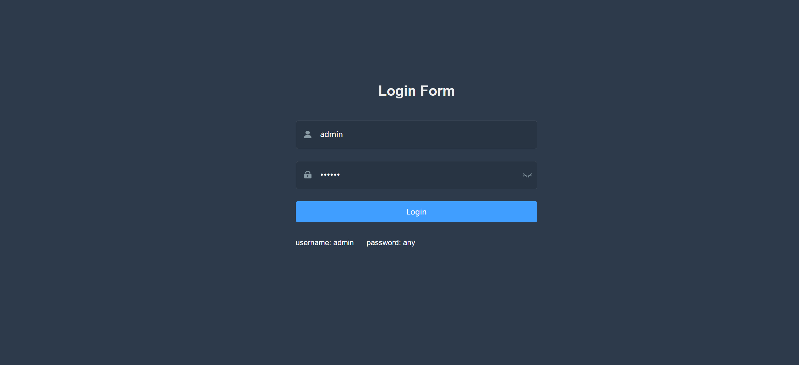
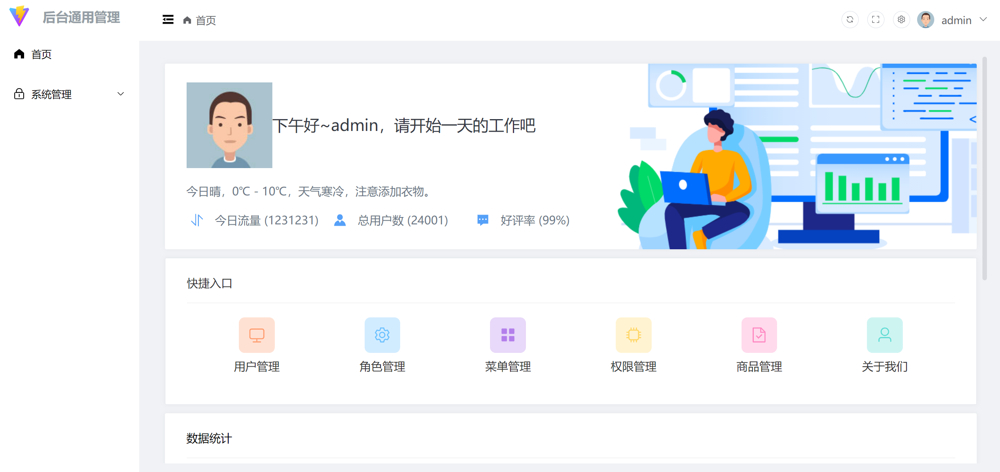

# 代码生成器
<h1 align="center">Awesome GitHub Profile README
<a href="https://www.producthunt.com/posts/awesome-github-profiles?utm_source=badge-featured&utm_medium=badge&utm_souce=badge-awesome-github-profiles" target="_blank"></a></h1>
<div align="center">

<a href="https://arbeitnow.com/?utm_source=awesome-github-profile-readme"></a>
<!--  -->

<a href="https://discord.gg/XTW52Kt"></a>
<a href="https://twitter.com/abhisheknaiidu" > </a>
<br>

<i>A curated list of awesome Github Profile READMEs</i>

<a href="https://github.com/abhisheknaiidu/awesome-github-profile-readme/stargazers"></a>
<a href="https://github.com/abhisheknaiidu/awesome-github-profile-readme/network/members"></a>
<a href="https://github.com/abhisheknaiidu/awesome-github-profile-readme/pulls"></a>
<a href="https://github.com/abhisheknaiidu/awesome-github-profile-readme/issues"></a>
<a href="https://github.com/abhisheknaiidu/awesome-github-profile-readme/graphs/contributors"></a>
<a href="https://github.com/abhisheknaiidu/awesome-github-profile-readme/blob/master/LICENSE"></a>

 </img>

<i>Loved the project? Please consider [donating](https://paypal.me/abhisheknaiidu) to help it improve!</i>

</div>

### Contents:
  - [Categories](#categories)
      - [GitHub Actions 🤖](#github-actions-)
      - [Game Mode 🚀](#game-mode-)
      - [Code Mode 👨🏽‍💻](#code-mode-)
      - [Dynamic Realtime 💫](#dynamic-realtime-)
      - [A Little Bit of Everything 😃](#a-little-bit-of-everything-)
      - [Descriptive 🗒](#descriptive-)
      - [Simple but Innovative Ones 🤗](#simple-but-innovative-ones-)
      - [Typing.. Mode 🎰](#typing-mode-)
      - [Anime 👾](#anime-)
      - [Minimalistic ✨](#minimalistic-)
      - [GIFS 👻](#gifs-)
      - [Just Images 🎭](#just-images-)
      - [Badges 🎫](#badges-)
      - [Fancy Fonts 🖋](#fancy-fonts-)
      - [Icons 🎯](#icons-)
      - [Retro 😎](#retro-)
  - [Tools](#tools)
  - [Articles](#articles)
  - [Video Tutorials](#tutorials)
  - [Contribute](#contribute)
  - [License](#license)

### 注意点：创建的maven项目一定要是带web的。项目名称一定要使用untitled 或者是untitled1之类的 不然就会有项目在创建时找不到路径的问题出现（此问题有待解决）。

## 前端模块：


## 单表模块：


后端模块：


# 前言

本代码生成器 致力于为广大群众用户解决重复代码的书写。打造一个完整的，易于维护的基本代码生成生态。集成各种重复模块，帮助用户在需要使用时快速构建，做到敏捷开发。


# 简介

基于maven、设计模式、DOM4j、freeMarker、SnakeYAML、freeMarker的代码生成器。此项目与别的项目不同。

包含多个方面：

可以生成前端基本架构 ：vue2、vue3、react等主流的前端框架的生成。（登录模块、用户权限rbac）

可以生成后端代码：

1. 一个基于maven 的多模块的后端架构（已经集成rbac操作），可以让开发人员专注于核心代码的书写
2. 单表的增删改查代码生成（会同时生成后端curd，前端（根据用户生成前端模块个数）） 可以根据用户选择打包为zip文件或者是将代码生成在项目中继续沿用此项目。

对后端模块进行集成：

本项目中集成了

1. spring scurity 模块  生成用户权限模块。对于权限管理做更为精细的管理
2. minio 模块   生成存储模块，解决用户做文件系统的麻烦开销
3. Elasticsearch 模块  生成检索模块 解决用户对于商城海量数据的搜索 采用Spring Data Es 减轻用户的操作难度，使之可以将时间留给核心逻辑


# 操作流程

## 第一步：

创建一个maven 项目

## 第二步：

导入依赖 （由于要下载很多依赖估计需要3分钟左右，请耐心等待）点击maven刷新：

```xml
<dependency> 
            <groupId>com.yszhdhy</groupId>  
            <artifactId>generator</artifactId>  
            <version>1.0-SNAPSHOT</version> 
        </dependency>  
    
    <repositories> 
        <repository> 
            <id>generator-repo</id>  
            <url>https://gitee.com/dachang-rolling-dog/maven-dependences/raw/master</url> 
        </repository> 
</repositories> 

```

## 第三步：

执行相关代码

1. 此步骤会创建基本的代码架构。
2. 在对应的数据库中创建相应的五张rbac权限表

```java


import com.yszhdhy.generator.model.project.Project;
import org.dom4j.DocumentException;

import java.io.FileNotFoundException;

public class CeShi {

    public static void main(String[] args) throws DocumentException, FileNotFoundException {

        Project project = new Project();
        /**
         * localhost 数据库地址
         * 3306 数据库端口号
         * root 用户名
         * 123456 密码
         * generator 数据库名称 （可有可无，没有会根据数据库名称创建，有的话就直接生成表）
         **/
        project.generate("localhost","3306","root","123456","generator");

    }

}

```

## 第四步：

重新选择jdk1.8 要重新加载一下项目。便可以启动项目了。会自动打开代码生成器的页面。

## 部署
在 service 子项目中 添加以下内容 也就是需要的打包的项目
```xml
<packaging>jar</packaging>

<build>
<plugins>
  <plugin>
    <groupId>org.springframework.boot</groupId>
    <artifactId>spring-boot-maven-plugin</artifactId>
  </plugin>
</plugins>
</build>
```


# 代码运行相关截图

- 后端所有模块集成：
- 前端生成模块
  - vue2
  - 
  - 
  - vue3
  - 
  - 
  - 
- 接口文档：

