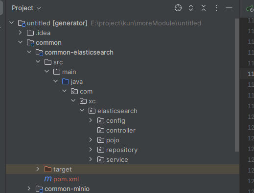
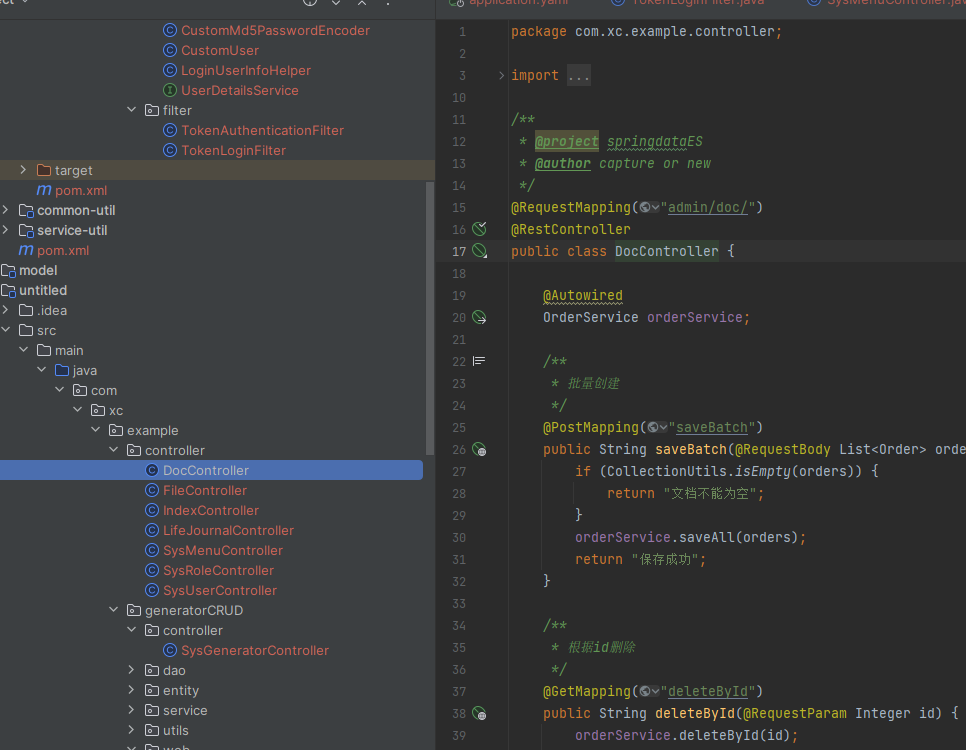

## 简介


Elasticsearch是一个开源的分布式搜索和分析引擎，用于全文搜索、实时分析和可视化数据。它是基于Apache Lucene搜索引擎库构建的，并提供了简单易用的RESTful API，使开发者可以轻松地构建各种类型的应用程序，从简单的搜索功能到复杂的大数据分析和可视化应用。

在本项目模块中使用的是 Spring Data Elasticsearch 

Spring Data Elasticsearch 是 Spring Data 项目中的一部分，它提供了与 Elasticsearch 集成的数据访问支持。它简化了在 Spring 应用程序中使用 Elasticsearch 数据存储的开发过程，使开发人员能够更轻松地执行数据的索引、搜索和查询操作。

>温馨提示： 在生成的模块中 只生成了CRUD等， 如果需要更多的功能请参考官网

>理念：将简单易用留给开发者，把复杂留给代码


## 操作流程：

运行项目  在弹出的页面中选择自己想要生成的模块。这里就是Elasticsearch模块 点击生成

>模块生成：
>
>- 就会在项目中的common 模块中生成相应的minio模块
>
>  - 
>
>- 会在service服务中生成对应的 `controller`
>
>- 会在service服务对应的 `application.yaml` 生成 elasticsearch对应的配置
>
>  ```yaml
>  elasticsearch:
>    port: 9200
>    host: 10.14.0.77
>  ```
> 
> 


以上就是elasticsearch模块生成的步骤了 无需任何操作 即可实现对模块的整合 变为自己项目中的starter


对应的API文档请详细查看：[Spring Data Elasticsearch比MP都要简单的方式 操作ES_屎码程序员的博客-CSDN博客](https://blog.csdn.net/qq_63946922/article/details/132035713?spm=1001.2014.3001.5501)

