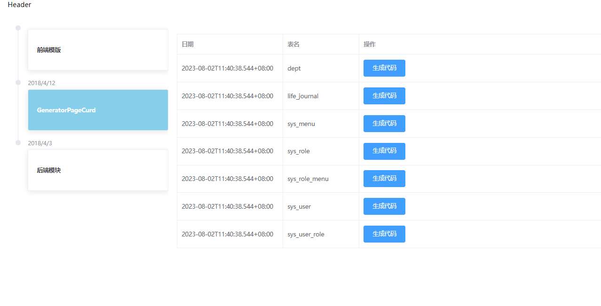
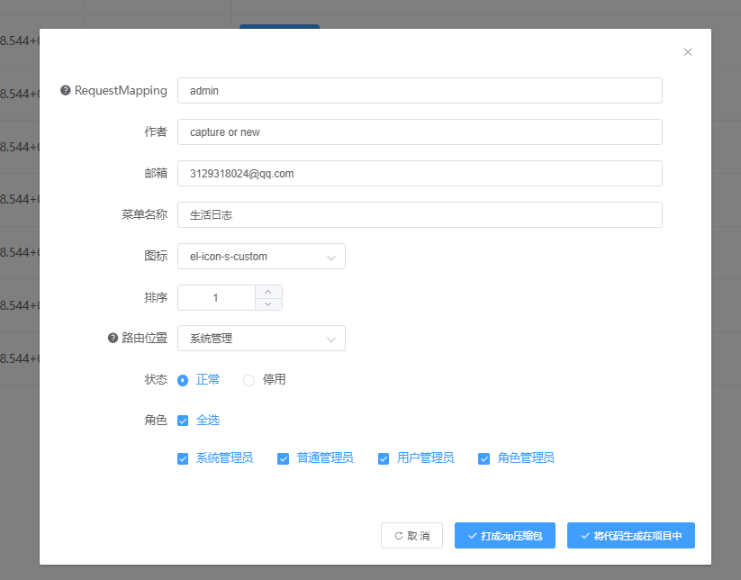

## 简介

CRUD 代码生成！这个模块会生成根据用户数据库中的表进行生成前后端分离的一个代码。就包括后端的crud服务，前端的页面展示（会根据你生成的前端模块而定。eg：你同时生成了vue2和vue3前端模块，那么代码页面就都会生成在对应的模块中）。代码会根据你的选择生成在项目中或是打成zip文件。

>理念：将简单易用留给开发者，把复杂留给代码

## 操作流程：

运行项目  在弹出的页面中选择自己想要生成的模块。这里就是crud模块 点击生成 (这个表是通过你项目连接数据库而展示的，也就是你的数据库中有多少表就会对应的展示多少表)

>模块生成：
>
>- 点击生成就会进入页面：
>
> - 根据自己的选择来生成对应的表即可
>
>- 生成后就会在项目中对应的包中生成文件。直接重启项目就可以了
>
>

以上就是单表模块生成的步骤了 无需任何多余操作，简单方便快捷即可生成对应的表。

