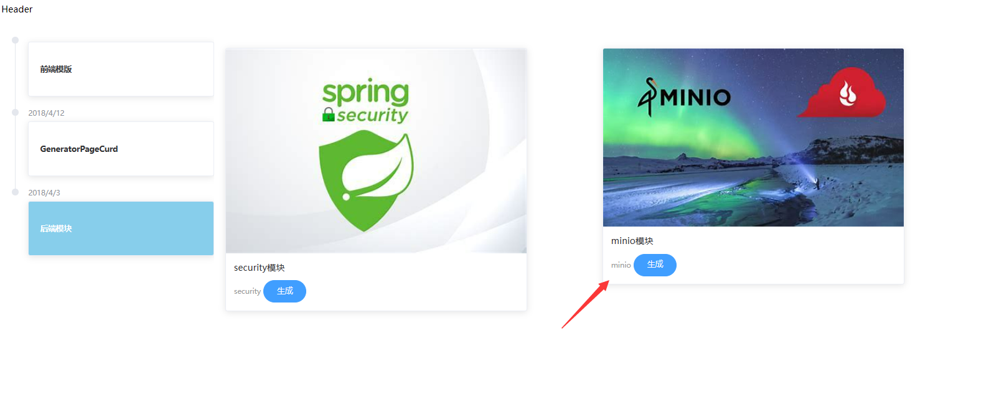
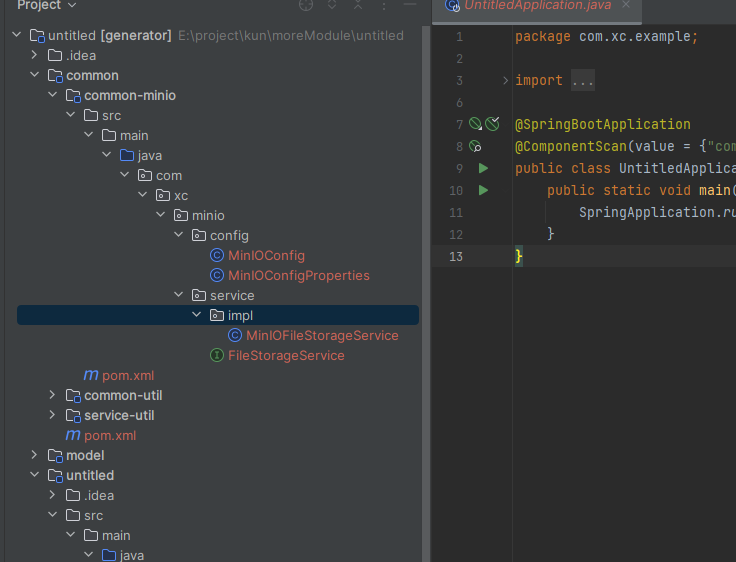
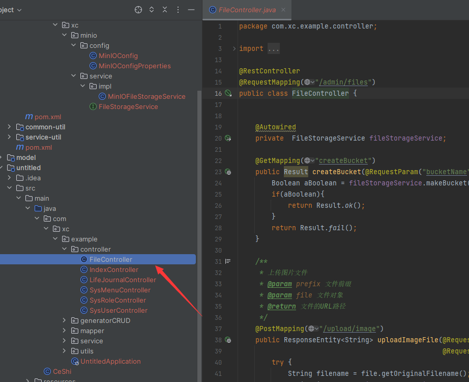

## 简介


MinIO是一个高性能、分布式对象存储系统，它是一个开源的软件，专门用于存储和检索大规模的非结构化数据，例如照片、视频、日志文件、备份数据等。MinIO的设计目标是实现最大化的可伸缩性和性能，同时提供简单易用的接口。

>温馨提示： 在生成的模块中 上传仅仅值包含了上传html文件和图片功能 如果需要更多的功能请参考官网

>理念：将简单易用留给开发者，把复杂留给代码


## 操作流程：

运行项目  在弹出的页面中选择自己想要生成的模块。这里就是minio模块 点击生成

>模块生成：
>
>- 就会在项目中的common 模块中生成相应的minio模块
>
>  - 
>
>- 会在service服务中生成对应的 `controller`
>
>- 会在service服务对应的 `application.yaml` 生成 minio对应的配置
>
>  ```yaml
>  minio:
>    bucket: leadnews # 存储桶
>    endpoint: http://10.14.0.77:9000 
>    readPath: http://10.14.0.77:9000
>    secretKey: minioadmin  # 用户名
>    accessKey: minioadmin # 密码
>  ```
>
>  


以上就是minio模块生成的步骤了 无需任何操作 即可实现对模块的整合 变为自己项目中的starter


## API 解释：

**createBucket**

```java
	/**
     * 创建存储bucket
     * @return Boolean
     */
    public Boolean makeBucket(String bucketName) {
        try {
            minioClient.makeBucket(MakeBucketArgs.builder()
                    .bucket(bucketName)
                    .build());
        } catch (Exception e) {
            e.printStackTrace();
            return false;
        }
        return true;
    }
```

**参数说明：**

| **类型** | **参数名** | **参数名** |
| :------: | :--------: | :--------: |
|  String  | bucketName | 存储桶名称 |

>特别注意：
>
>- 在创建此存储桶时一定要检查看存储桶是否存在 如果存在则会出现异常


**uploadPic：**

```java
    /**
     *  上传图片文件
     * @param prefix  文件前缀
     * @param filename  文件名
     * @param inputStream 文件流
     * @return  文件全路径
     */
    @Override
    public String uploadImgFile(String prefix, String filename,InputStream inputStream) {
        String filePath = builderFilePath(prefix, filename); // 按照时间进行返回路径
        try {
            PutObjectArgs putObjectArgs = PutObjectArgs.builder()
                    .object(filePath)
                    .contentType("image/jpg")
                    .bucket(minIOConfigProperties.getBucket()).stream(inputStream,inputStream.available(),-1)
                    .build();
            minioClient.putObject(putObjectArgs);
            // 以下操作都是在拼接路径
            StringBuilder urlPath = new StringBuilder(minIOConfigProperties.getReadPath());
            urlPath.append(separator+minIOConfigProperties.getBucket());
            urlPath.append(separator);
            urlPath.append(filePath);
            return urlPath.toString();
        }catch (Exception ex){
            log.error("minio put file error.",ex);
            throw new RuntimeException("上传文件失败");
        }
    }
```

**参数说明：**

|  **类型**   | **参数名**  | **参数名** |
| :---------: | :---------: | :--------: |
|   String    |   prefix    |  文件前缀  |
|   String    |  filename   |   文件名   |
| InputStream | inputStream |   文件流   |


**uploadHtml**

```java
    /**
     *  上传html文件
     * @param prefix  文件前缀
     * @param filename   文件名
     * @param inputStream  文件流
     * @return  文件全路径
     */
    @Override
    public String uploadHtmlFile(String prefix, String filename,InputStream inputStream) {
        String filePath = builderFilePath(prefix, filename);
        try {
            PutObjectArgs putObjectArgs = PutObjectArgs.builder()
                    .object(filePath)
                    .contentType("text/html")
                    .bucket(minIOConfigProperties.getBucket()).stream(inputStream,inputStream.available(),-1)
                    .build();
            minioClient.putObject(putObjectArgs);
            StringBuilder urlPath = new StringBuilder(minIOConfigProperties.getReadPath());
            urlPath.append(separator+minIOConfigProperties.getBucket());
            urlPath.append(separator);
            urlPath.append(filePath);
            return urlPath.toString();
        }catch (Exception ex){
            log.error("minio put file error.",ex);
            ex.printStackTrace();
            throw new RuntimeException("上传文件失败");
        }
    }
```

**参数说明：**

|  **类型**   | **参数名**  | **参数名** |
| :---------: | :---------: | :--------: |
|   String    |   prefix    |  文件前缀  |
|   String    |  filename   |   文件名   |
| InputStream | inputStream |   文件流   |


**delete：**

```java
    /**
     * 删除文件
     * @param pathUrl  文件全路径
     */
    @Override
    public void delete(String pathUrl) {
        String key = pathUrl.replace(minIOConfigProperties.getEndpoint()+"/","");
        int index = key.indexOf(separator);
        String bucket = key.substring(0,index);
        String filePath = key.substring(index+1);
        // 删除Objects
        RemoveObjectArgs removeObjectArgs = RemoveObjectArgs.builder().bucket(bucket).object(filePath).build();
        try {
            minioClient.removeObject(removeObjectArgs);
        } catch (Exception e) {
            log.error("minio remove file error.  pathUrl:{}",pathUrl);
            e.printStackTrace();
        }
    }
```

**参数说明：**

| **类型** | **参数名** | **参数名** |
| :------: | :--------: | :--------: |
|  String  |  pathUrl   | 文件全路径 |


**downLoad：**

```java
    /**
     * 下载文件
     * @param pathUrl  文件全路径
     * @return  文件流
     *
     */
    @Override
    public byte[] downLoadFile(String pathUrl)  {
        String key = pathUrl.replace(minIOConfigProperties.getEndpoint()+"/","");
        int index = key.indexOf(separator);
        String bucket = key.substring(0,index);
        String filePath = key.substring(index+1);
        InputStream inputStream = null;
        try {
            inputStream = minioClient.getObject(GetObjectArgs.builder().bucket(minIOConfigProperties.getBucket()).object(filePath).build());
        } catch (Exception e) {
            log.error("minio down file error.  pathUrl:{}",pathUrl);
            e.printStackTrace();
        }

        ByteArrayOutputStream byteArrayOutputStream = new ByteArrayOutputStream();
        byte[] buff = new byte[100];
        int rc = 0;
        while (true) {
            try {
                if (!((rc = inputStream.read(buff, 0, 100)) > 0)) break;
            } catch (IOException e) {
                e.printStackTrace();
            }
            byteArrayOutputStream.write(buff, 0, rc);
        }
        return byteArrayOutputStream.toByteArray();
    }
```

**参数说明：**

| **类型** | **参数名** | **参数名** |
| :------: | :--------: | :--------: |
|  String  |  pathUrl   | 文件全路径 |