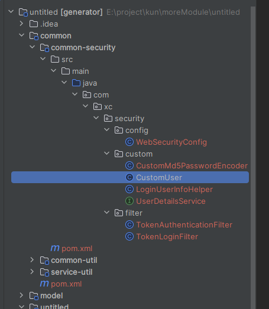
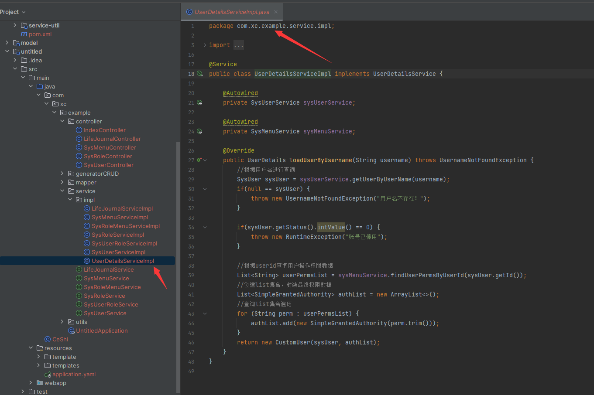

## 简介


Spring Security是一个基于Spring框架的安全性框架，用于在Java应用程序中提供身份认证和访问控制功能。它是Spring社区中广泛使用的一个子项目，为开发人员提供了一套强大的工具和API，用于保护应用程序免受未经授权的访问和恶意攻击。

>温馨提示： 对于小白用户不建议使用模块 虽然其功能强大 能为我们的项目保驾护航，但是也有很大的难度去驾驭它，生成的项目基架已经实现了基于 rbac 的权限控制管理。故而建议对Spring Security有其了解的开发人员生成此模块并使用

>理念：将简单易用留给开发者，把复杂留给代码


## 操作流程：

运行项目  在弹出的页面中选择自己想要生成的模块。这里就是`security`模块 点击生成

>模块生成：
>
>- 就会在项目中的`common` 模块中生成相应的`security`模块
>
> - 
>
>- 会在`service`服务中生成对应的 ` UserDetailsServiceImpl`
>
>- 由于此处用到了`redis`会在`service`服务对应的 `application.yaml` 生成 `redis`对应的配置
>
> ```yaml
>  redis:
>    port: 6379
>    host: localhost
> ```
>
>>
>>
>>提示：如果对spring scurity有了解的可以自行更改代码 做到不使用redis中间件


以上就是spring scurity模块生成的步骤了 无需任何操作 即可实现对模块的整合 变为自己项目中的starter


**注意点：如果生成 scurity模块后。之前生成的CRUD代码就无法访问数据。因为考虑到剪切的方便，我并未将请求统一管理，而是就附在每个页面中的，所以每个请求头中并未包含token，故而会验证失败。**


## API 解释：

